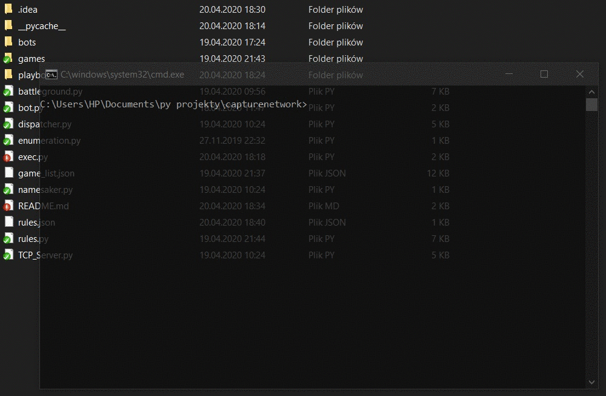
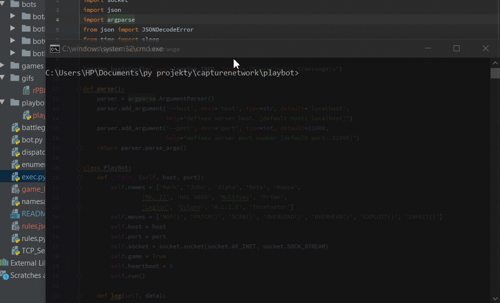

# Capture The Network

[](https://lgtm.com/projects/g/devdo-eu/capturenetwork/context:python)
[](https://lgtm.com/projects/g/devdo-eu/capturenetwork/alerts/)


A competitive bot game where the key to victory is a clever algorithm

## Getting Started

This repository consists of three parts.
 * The first part is the game server,<br>which calculates the results of rounds and the whole skirmish.
 * Second part is bot template, to fill up with clever algorithm
 * Third part is Jupyter Notebook for statistics generation after bot battle for more insight.

### Deployment

To run Battle Server you need Python > 3.6

When prerequisites are met then open console prompt:

```batch
.\capturenetwork>python exec.py -h
usage: exec.py [-h] [--host HOST] [--port PORT]

optional arguments:
  -h, --help   show this help message and exit
  --host HOST  defines server host. [default host: localhost]
  --port PORT  defines server port number [default port: 21000]
```



Battle Server must be up&ready to run bot,
 
also you need to know host and port to connect.

Bot to work properly need Python > 3.6

```batch
.\capturenetwork\playbot>python playbot.py -h
usage: playbot.py [-h] [--host HOST] [--port PORT]

optional arguments:
  -h, --help   show this help message and exit
  --host HOST  defines server host. [default host: localhost]
  --port PORT  defines server port number [default port: 21000]
```



## Related Project

You can find UI for this project here: [capturenetworkUI](https://github.com/ppolakiewicz/capturenetworkUI)<br>
It is developed by [Paweł Polakiewicz](https://github.com/ppolakiewicz)

## Authors

* **Grzegorz Maciaszek** - *Initial work* - [Devdo.eu](https://github.com/devdo-eu)

## License

MIT License

Copyright (c) 2020 Grzegorz Maciaszek
